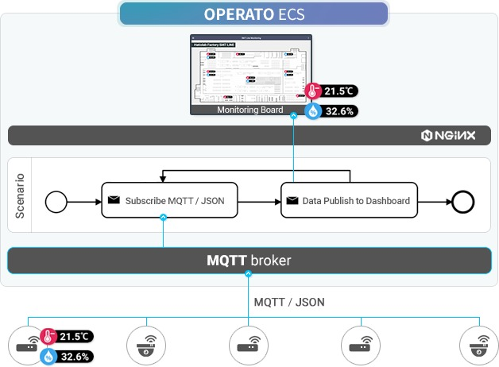

# Tutorial 1 - Installation

- installation target OS
  - recommended : Linux
  - available (tested) : MacOS
  - available (not tested) : Windows
- internet browser
  - recommended : google Chrome, Safari, Firefox
  - available (not tested) : Edge
  - not supported : Internet Explorer
- prerequites
  - ‘docker' and 'docker-compose' should be installed prely
  - https://www.docker.com/
- operato-ecs installation start script
  - create a folder for the application and change directory to your folder.
  - first script will install operato-ecs without mosquitto, run the second script if you need both operato-ecs and mosquitto

```
# install script for operato-ecs
curl -fsSL https://raw.githubusercontent.com/things-factory/installer/master/operato-ecs/install.sh | bash -s
```

```
# install script for operato-ecs and mosquitto
curl -fsSL https://raw.githubusercontent.com/things-factory/installer/master/operato-ecs-with-mosquitto/install.sh | bash -s
```

# Tutorial 2 - Simple Scenario



- prerequisite 
  - install ‘mosquitto’ at https://mosquitto.org/ 
- publishing sample sensor data to mosquitto
  - execute each of the following script in your terminal to publish the data

```
curl -fsSL https://raw.githubusercontent.com/things-factory/installer/master/operato-ecs-tutorial/emulator-mqtt-sensor.sh | bash -s sensor1
curl -fsSL https://raw.githubusercontent.com/things-factory/installer/master/operato-ecs-tutorial/emulator-mqtt-sensor.sh | bash -s sensor2
curl -fsSL https://raw.githubusercontent.com/things-factory/installer/master/operato-ecs-tutorial/emulator-mqtt-sensor.sh | bash -s sensor3
curl -fsSL https://raw.githubusercontent.com/things-factory/installer/master/operato-ecs-tutorial/emulator-mqtt-sensor.sh | bash -s sensor4
```
