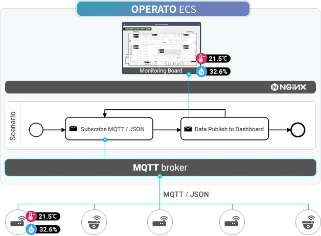

# Tutorial 2 - Start with a Simple Scenario

[](https://youtu.be/MdOpjZxVZ_c)

## Tutorial scenario



- prerequisite
  - after installing operato ecs only
    - install ‘mosquitto’ at https://mosquitto.org/
  - after installing 'operato ecs with mosquitto'
    - install 'mosquitto-clients'
      - in ubuntu : refer to https://zoomadmin.com/HowToInstall/UbuntuPackage/mosquitto-clients
- endpoint after installing operato ecs only
  - if mosquitto server is installed same server
    - mqtt://localhost:1883
  - if mosquitto server is installed another host
    - mqtt://<host IP - mosquitto-broker installed>>:1883
- endpoint after installing 'operato ecs with mosquitto'
  - mqtt://mosquitto:1883
- publishing sample sensor data to mosquitto
  - execute each of the following script in your terminal to publish the data

```
curl -fsSL https://raw.githubusercontent.com/things-factory/installer/master/operato-ecs-tutorial/emulator-mqtt-sensor.sh | bash -s sensor1 localhost
curl -fsSL https://raw.githubusercontent.com/things-factory/installer/master/operato-ecs-tutorial/emulator-mqtt-sensor.sh | bash -s sensor2 localhost
curl -fsSL https://raw.githubusercontent.com/things-factory/installer/master/operato-ecs-tutorial/emulator-mqtt-sensor.sh | bash -s sensor3 localhost
curl -fsSL https://raw.githubusercontent.com/things-factory/installer/master/operato-ecs-tutorial/emulator-mqtt-sensor.sh | bash -s sensor4 localhost
```
